# Job Interview Simulator - System Flowchart

## Accurate System Architecture Flow

Based on the actual codebase implementation.

---

## Mermaid Flowchart (Copy-paste into Mermaid viewer)

```mermaid
flowchart TD
    Start([User Starts Conversation]) --> ChatMsg[User sends ChatMessage]
    ChatMsg --> InterviewerAgent[Interviewer Agent]
    InterviewerAgent --> ACK[Send ChatAcknowledgement]
    
    ACK --> CheckRole{Role Set?}
    CheckRole -->|No| AutoRole[Auto-set Role: Junior Data Analyst]
    AutoRole --> CheckPersona
    CheckRole -->|Yes| CheckPersona{Persona Selected?}
    
    CheckPersona -->|No| ShowAvatars[Display Avatar Options:<br/>HR, Junior Dev,<br/>Senior Dev, Corporate Exec]
    ShowAvatars --> UserSelects[User Selects Avatar]
    UserSelects --> StorePersona[Store Persona Selection]
    
    StorePersona --> QueryKG1[Query InterviewKG:<br/>get_focus_skills]
    QueryKG1 --> KG1[MeTTa Knowledge Graph<br/>Returns Focus Skills]
    KG1 --> GenFirstQ[Generate First Question<br/>via ASI Cloud API]
    
    GenFirstQ --> SendQ1[Send First Question to User]
    
    CheckPersona -->|Yes| UserAnswers[User Provides Answer]
    SendQ1 --> UserAnswers
    
    UserAnswers --> StoreAnswer[Store Answer in Session]
    StoreAnswer --> AddToHistory[Add Q&A to conversation_history]
    AddToHistory --> SendEvalReq[Send EvaluationRequest<br/>to Evaluator Agent<br/>ASYNC/Non-blocking]
    
    SendEvalReq --> QueryKG2[Query InterviewKG:<br/>get_topics_for_persona<br/>get_focus_skills]
    QueryKG2 --> KG2[MeTTa Knowledge Graph<br/>Returns Topics & Skills]
    KG2 --> GenNextQ[Generate Next Adaptive Question<br/>via ASI Cloud API<br/>Uses conversation_history + KG]
    
    GenNextQ --> CheckDone{All 5 Questions<br/>Answered?}
    
    CheckDone -->|No| SendNextQ[Send Next Question to User]
    SendNextQ --> UserAnswers
    
    CheckDone -->|Yes| MarkFinished[Mark Interview Finished]
    MarkFinished --> WaitMsg[Send: Generating report...]
    
    SendEvalReq -.-> EvalAgent[Evaluator Agent]
    EvalAgent --> CallLLM[Call ASI Cloud API<br/>to Evaluate Answer]
    CallLLM --> EvalScores[Calculate Scores:<br/>Clarity, Specificity,<br/>Confidence, Overall]
    EvalScores --> BuildResponse[Build EvaluationResponse<br/>with scores, feedback,<br/>improved answer]
    BuildResponse -.->|EvaluationResponse| InterviewerAgent
    
    InterviewerAgent --> StoreEval[Store Evaluation Silently<br/>No user feedback]
    StoreEval --> CheckFinished{Interview<br/>Finished?}
    
    CheckFinished -->|Yes| CheckAllEvals{All Evaluations<br/>Received?}
    CheckFinished -->|No| Continue
    
    CheckAllEvals -->|Yes| GenReport[Generate Final Report:<br/>- Average scores<br/>- Per-question breakdown<br/>- Strengths<br/>- Areas to improve<br/>- Next steps]
    GenReport --> SendReport[Send Final Report to User]
    SendReport --> End([Interview Complete])
    
    WaitMsg --> CheckAllEvals
    
    style InterviewerAgent fill:#e1f5ff
    style EvalAgent fill:#fff4e1
    style KG1 fill:#e8f5e9
    style KG2 fill:#e8f5e9
    style GenFirstQ fill:#f3e5f5
    style GenNextQ fill:#f3e5f5
    style CallLLM fill:#f3e5f5
    style GenReport fill:#ffebee
```



---

## Detailed Text-Based Flow

### Phase 1: Initialization

1. **User sends message** → Interviewer Agent receives `ChatMessage`
2. **Interviewer Agent** → Sends `ChatAcknowledgement` back
3. **Check Session State**:
   - If no role set → Auto-set to "Junior Data Analyst"
   - If no persona set → Display avatar selection menu

### Phase 2: Avatar Selection

4. **User selects avatar** (HR, Junior Developer, Senior Developer, Corporate Executive)
5. **Interviewer Agent**:
   - Stores persona selection
   - Logs persona choice to history
6. **Query Knowledge Graph**:
   - Calls `interview_kg.get_focus_skills(persona)` 
   - MeTTa KG returns focus skills for persona
7. **Generate First Question**:
   - Calls ASI Cloud API with:
     - Persona description
     - Focus skills from KG
     - Role context
   - ASI Cloud generates broad opening question
8. **Send persona introduction + first question** to user

### Phase 3: Interview Loop (Repeats 5 times)

9. **User provides answer**
10. **Interviewer Agent**:
    - Stores answer in session
    - Adds Q&A pair to `conversation_history`
    - Increments `question_index`

11. **Send Evaluation Request** (ASYNC, non-blocking):
    - Creates `EvaluationRequest` message
    - Sends to Evaluator Agent address
    - **Does NOT wait** for response
    - Continues immediately

12. **Query Knowledge Graph for Next Question**:
    - Calls `interview_kg.get_focus_skills(persona)`
    - Calls `interview_kg.get_topics_for_persona(persona, limit=3)`
    - MeTTa KG returns skills and recommended topics

13. **Generate Adaptive Question**:
    - Calls ASI Cloud API with:
      - Full `conversation_history` (all previous Q&A pairs)
      - Persona description
      - Focus skills from KG
      - Recommended topics from KG
      - Question number
    - ASI Cloud generates adaptive follow-up question

14. **Check if all 5 questions answered**:
    - If NO → Send next question immediately
    - If YES → Mark interview as finished, send "Generating report..." message

### Phase 4: Evaluation (Happens in Parallel)

15. **Evaluator Agent receives EvaluationRequest**
16. **Evaluator Agent**:
    - Calls ASI Cloud API with evaluation prompt:
      - Question and answer
      - Role and persona context
      - Scoring criteria (Clarity, Specificity, Confidence)
    - ASI Cloud returns JSON with scores and feedback

17. **Evaluator Agent builds EvaluationResponse**:
    - Extracts scores (clarity, specificity, confidence)
    - Calculates overall score (average)
    - Formats feedback text
    - Generates improved answer example

18. **Evaluator Agent sends EvaluationResponse** back to Interviewer Agent

19. **Interviewer Agent receives EvaluationResponse**:
    - Stores evaluation data silently (no user feedback)
    - Adds to `session.evaluations` list
    - Logs to user history

20. **Check if interview finished AND all evaluations received**:
    - If YES → Generate final report
    - If NO → Continue waiting

### Phase 5: Final Report Generation

21. **Generate Comprehensive Report**:
    - Calculate average scores (clarity, specificity, confidence, overall)
    - Analyze scores to identify strengths and areas to improve
    - Format per-question breakdown with:
      - Question text
      - User's answer
      - Scores for each dimension
      - Feedback text
      - Improved answer example
    - Generate strengths list (2-3 items)
    - Generate areas to improve list (2-3 items)
    - Generate actionable next steps

22. **Send Final Report** to user

23. **Interview Complete**

---

## Component Interaction Diagram

```
┌─────────────────────────────────────────────────────────────┐
│                    Agentverse Chat UI                        │
│                  (User Interface)                            │
└────────────────────┬────────────────────────────────────────┘
                     │ ChatMessage (bidirectional)
                     │
┌────────────────────▼────────────────────────────────────────┐
│              Interviewer Agent                               │
│  ┌──────────────────────────────────────────────────────┐   │
│  │  SessionState Management                              │   │
│  │  - role, persona, question_index                     │   │
│  │  - answers[], evaluations[], questions[]             │   │
│  │  - conversation_history[]                            │   │
│  └──────────────────────────────────────────────────────┘   │
│                                                              │
│  ┌──────────────────────────────────────────────────────┐   │
│  │  InterviewKG Wrapper                                  │   │
│  │  (Direct Python Calls - In-Process)                  │   │
│  └────────────────────┬─────────────────────────────────┘   │
└───────────────────────┼─────────────────────────────────────┘
                        │
                        │ Python function calls
                        │
┌───────────────────────▼─────────────────────────────────────┐
│         MeTTa Knowledge Graph (Pure Python)                 │
│  ┌──────────────────────────────────────────────────────┐   │
│  │  - Persona → Focus Skills                            │   │
│  │  - Persona → Topic Priorities                        │   │
│  │  - Question → Skills Mapping                         │   │
│  │  - Role Requirements                                 │   │
│  └──────────────────────────────────────────────────────┘   │
└─────────────────────────────────────────────────────────────┘

┌───────────────────────┐         ┌──────────────────────────┐
│  Interviewer Agent    │────────▶│   Evaluator Agent        │
│                       │         │                          │
│  Sends:               │         │  Receives:               │
│  EvaluationRequest    │         │  EvaluationRequest       │
│                       │◀────────│                          │
│  Receives:            │         │  Sends:                  │
│  EvaluationResponse   │         │  EvaluationResponse      │
└───────────────────────┘         └──────────────────────────┘
                                           │
                                           │ HTTP API Calls
                                           │
                                  ┌────────▼──────────┐
                                  │  ASI Cloud API    │
                                  │  (asi1-mini)      │
                                  │                   │
                                  │  Question Gen     │
                                  │  Answer Eval      │
                                  └───────────────────┘
```

---

## Data Flow Summary

### Question Generation Flow

1. **Interviewer Agent** → Query `InterviewKG.get_focus_skills(persona)`
2. **InterviewKG** → Query `MeTTa KG.match("focus_skill", persona, "$skill")`
3. **MeTTa KG** → Returns focus skills list
4. **Interviewer Agent** → Query `InterviewKG.get_topics_for_persona(persona)`
5. **InterviewKG** → Query `MeTTa KG.match("persona_priority", persona, "$topic", "$weight")`
6. **MeTTa KG** → Returns topic priorities
7. **Interviewer Agent** → Build prompt with:
   - Persona description
   - Focus skills from KG
   - Topic priorities from KG
   - Conversation history (for adaptive questions)
8. **Interviewer Agent** → HTTP POST to ASI Cloud API
9. **ASI Cloud API** → Returns generated question
10. **Interviewer Agent** → Sends question to user

### Evaluation Flow

1. **Interviewer Agent** → Creates `EvaluationRequest`:
   - question, answer, persona, role, user_address
2. **Interviewer Agent** → Sends async message to Evaluator Agent
3. **Evaluator Agent** → Receives `EvaluationRequest`
4. **Evaluator Agent** → Builds evaluation prompt
5. **Evaluator Agent** → HTTP POST to ASI Cloud API
6. **ASI Cloud API** → Returns JSON with:
   - clarity, specificity, confidence (1-5)
   - feedback text
   - improved_answer
7. **Evaluator Agent** → Creates `EvaluationResponse`
8. **Evaluator Agent** → Sends back to Interviewer Agent
9. **Interviewer Agent** → Stores evaluation silently
10. **Interviewer Agent** → When interview finished + all evals received → Generate final report

---

## Key Design Decisions Reflected in Flow

1. **Async Evaluation**: Evaluations happen in background, interview continues without waiting
2. **Knowledge Graph Integration**: KG consulted for every question to ensure alignment with persona
3. **Adaptive Questions**: Each question uses full conversation history for natural flow
4. **Silent Evaluation**: No feedback shown during interview, all at end
5. **Two-Agent Architecture**: Separation of concerns (interview flow vs evaluation)

---

## Notes

- All communication between Interviewer Agent and InterviewKG is **in-process Python calls** (no network)
- Communication between Interviewer Agent and Evaluator Agent is **async agent messaging** (network)
- Both agents call ASI Cloud API via **HTTP requests**
- MeTTa Knowledge Graph is **pure Python** (no external dependencies)
- Session state is **persisted** using uAgents storage

